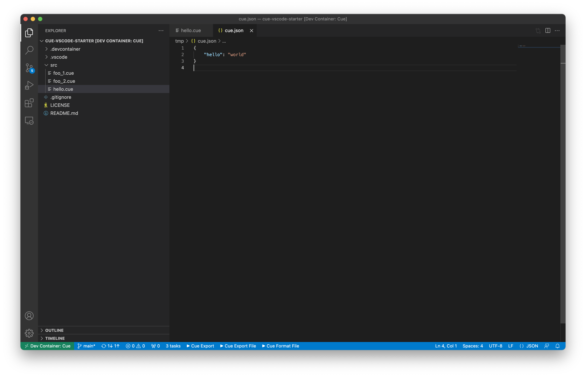
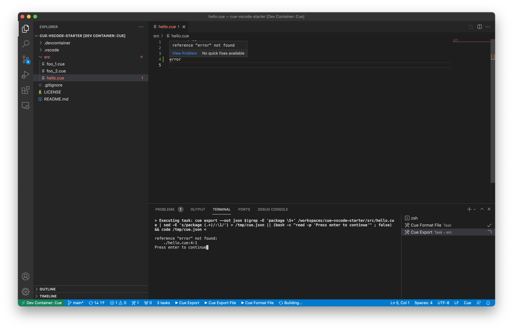

# cue-vscode-starter

This is a [Visual Studio Code Remote - Containers][vscode_remote_containers] project/environment
made for [Cue].




## Instructions

```
# Clone the repository
git clone https://github.com/golem-ai/cue-vscode-starter.git

# Open in VS Code
code ./cue-vscode-starter
```

VS Code might ask you whether you trust the author ... make sure you accept ;-):
```
Yes, I trust the authors
Trust folder and enable all features
```

Make sure Docker is running on your computer.

Press CMD+SHIFT+P and choose/run `Remote-Containers: Rebuild and Reopen in Container`.

The `Startubg Dev Container` step might take a few minutes to pull the docker image.

Open a `.cue` file, and run one of the included tasks:
- `Cue Export`
- `Cue Export File`
- `Cue Format File`

You should be able to find buttons/shortcuts for those tasks in the VS Code footer.

[vscode_remote_containers]: https://code.visualstudio.com/docs/remote/containers
[cue]: https://cuelang.org
